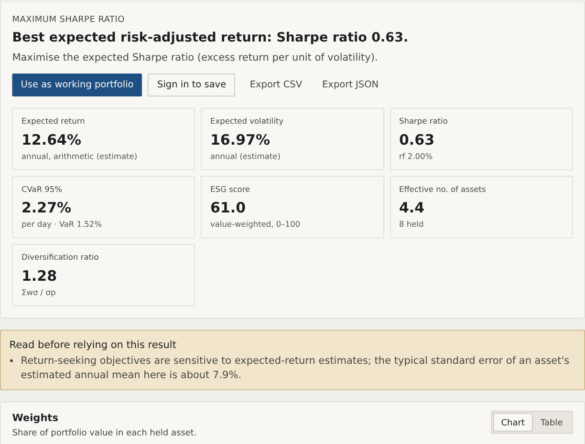
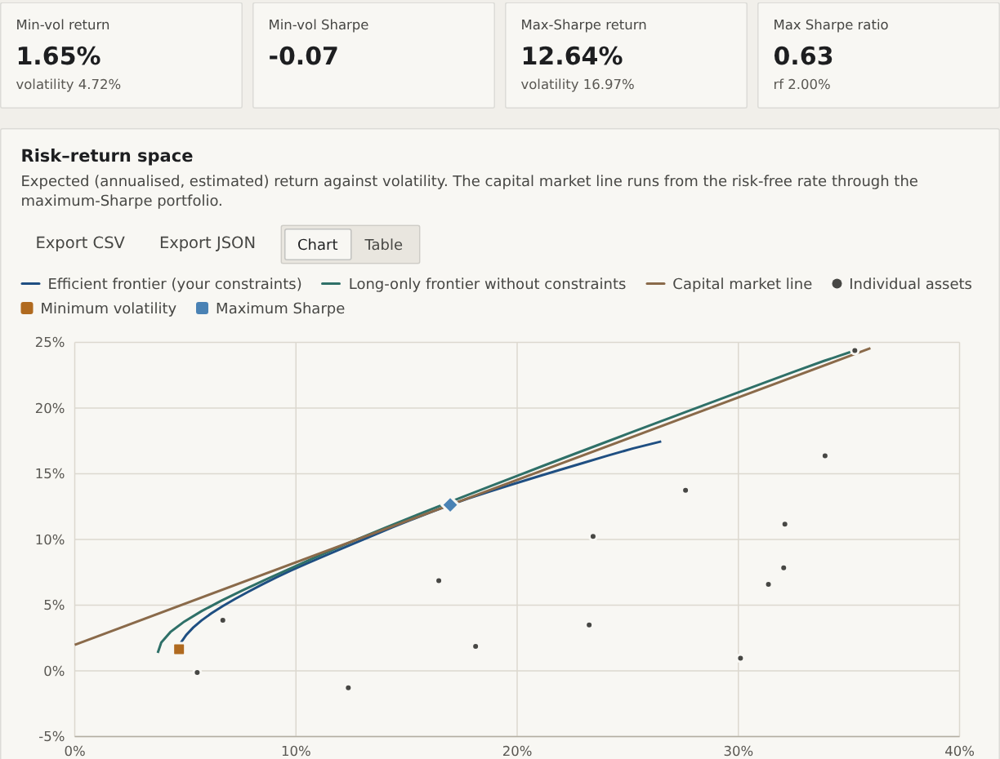
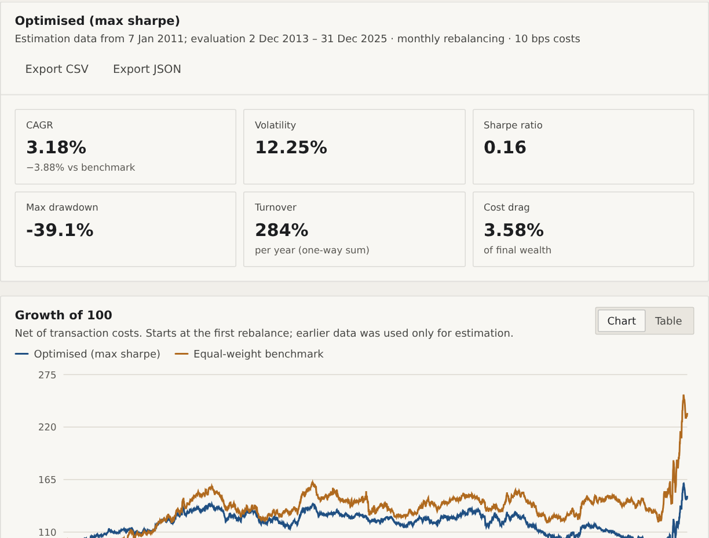
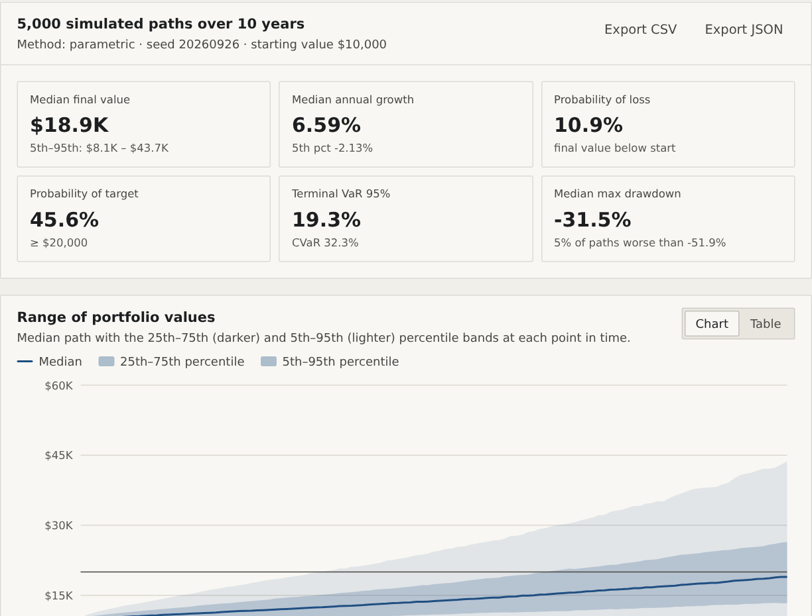

# Ardentum

**Quantitative portfolio analysis you can explain.** Ardentum is a free web platform for
building, optimising, simulating and backtesting investment portfolios, with the
mathematics, assumptions and limitations behind every result.

**Live:** https://ardentum-frontend.pages.dev · **Licence:** MIT · **Cite:** see
[Citing Ardentum](#citing-ardentum)



> Ardentum is an analytical tool for education and research. It does not give investment
> advice. The bundled demo universe is **synthetic** (tickers end in `.SYN`) and labelled
> as such.

## What it does

| | |
|---|---|
| **Optimisation** | Minimum volatility, maximum Sharpe (exact convex reformulation), target return or volatility, mean-variance utility, minimum CVaR (Rockafellar-Uryasev) |
| **Constraints** | Position bounds, exclusions, sector limits, gross exposure, tracking error, minimum ESG score, ESG preference. Every solution is checked against every constraint. |
| **Estimation** | Historical and Bayes-Stein means; sample and Ledoit-Wolf covariance; Black-Litterman views with Idzorek confidences |
| **Analysis** | Mean-variance, ESG-efficient and mean-CVaR frontiers; risk decomposition; binding constraints (KKT); why each holding is there; weight stability under resampling |
| **Simulation** | Seeded parametric, bootstrap and stationary block-bootstrap Monte Carlo, with contributions, withdrawals and the chance of running out |
| **Backtesting** | Walk-forward with no look-ahead, transaction costs, Cariño-linked and Brinson-Fachler attribution, side-by-side comparison |
| **Data** | US industry returns since 1926 (Kenneth R. French Data Library); ECB exchange rates, unhedged or hedged at BIS policy rates; open ESG scores from WikiRate (CC BY 4.0); CSV uploads |
| **Platform** | Accounts (Supabase Auth, Google sign-in), saved portfolios, CSV and JSON export, methodology pages with every formula, a guided tour, a classroom lesson with a printable worksheet, and public anonymous usage counts |

| Efficient frontier | Walk-forward backtest | Monte Carlo |
|---|---|---|
|  |  |  |

## How results are checked

Every financial calculation lives in `backend/src/ardentum/quant/` and is tested against
an independent answer: closed forms, SciPy, scikit-learn, PyPortfolioOpt, brute-force
search or the KKT optimality conditions. Backtests are tested for look-ahead: changing
any future return must not change a past decision. Undefined results are reported with
the reason instead of a number, and infeasible requests say what to change. Details:
[docs/methodology/09-validation.md](docs/methodology/09-validation.md).

## Research

[`research/`](research/README.md) holds three reproducible studies built on the engine,
rerun from public data by a GitHub workflow:

1. **The 1/N puzzle, twenty years later.** Does optimising beat equal weights out of
   sample, and has the answer from DeMiguel, Garlappi and Uppal (2009) held since 2005?
2. **Should a European investor hedge the dollar?** Risk and crisis returns for euro
   and sterling investors in US shares, hedged and unhedged, since 1999.
3. **The optimiser's promise versus reality.** How far realised Sharpe ratios fall
   short of the in-sample promise, and how much shrinkage estimators close the gap.

## Repository layout

```
backend/     FastAPI service and the quantitative engine (Python 3.12, uv)
  src/ardentum/quant/     pure, tested financial mathematics
  src/ardentum/data/      data providers, CSV parsing, validation, synthetic demo data
  src/ardentum/services/  orchestration (no maths)
  src/ardentum/api/       HTTP layer: routers, schemas, auth, errors
  migrations/             Alembic migrations (PostgreSQL)
frontend/    Next.js + TypeScript + Tailwind web app, Playwright end-to-end tests
docs/        methodology (rendered in the app), set-up guide, release notes
research/    reproducible studies and their results
```

Design and project records: [ARCHITECTURE.md](ARCHITECTURE.md) ·
[DECISIONS.md](DECISIONS.md) · [PROGRESS.md](PROGRESS.md) · [TODO.md](TODO.md) ·
[DEPLOYMENT.md](DEPLOYMENT.md) · [CHANGELOG.md](CHANGELOG.md)

## Run it locally

Prerequisites: Python 3.12 with [uv](https://docs.astral.sh/uv/), Node.js 22.

```bash
# 1. API (SQLite, development sign-in) on http://localhost:8000
cd backend
uv sync
uv run uvicorn ardentum.api.main:create_app --factory --reload --port 8000

# 2. Web app on http://localhost:3000 (proxies /api/v1 to the API)
cd frontend
npm ci
npm run dev
```

Open http://localhost:3000 and choose **Open the workspace**. In development any email
signs you in (no password); production uses Supabase Auth. Or run the full stack with
PostgreSQL in Docker: `docker compose up --build`.

## Tests

```bash
cd backend && uv run pytest -q          # unit and API tests (SQLite)
cd backend && uv run ruff check src tests && uv run mypy
cd frontend && npm run lint && npm run typecheck && npm test
cd frontend && npx playwright test      # starts API and web app, runs end-to-end workflows
uv run --project backend --with matplotlib python -m pytest -q research/tests
```

Run the API tests against PostgreSQL with
`ARDENTUM_TEST_DATABASE_URL=postgresql://... uv run pytest tests/api`.

## Configuration and deployment

See [backend/.env.example](backend/.env.example), [frontend/.env.example](frontend/.env.example)
and [DEPLOYMENT.md](DEPLOYMENT.md). The production stack runs on free tiers: Cloudflare
Pages (web), Render (API) and Supabase (sign-in and PostgreSQL). Live market data for
individual securities (Tiingo) and the FRED risk-free rate are enabled by API keys; check
each licence before commercial use.

## Citing Ardentum

GitHub's **Cite this repository** button gives APA and BibTeX from
[CITATION.cff](CITATION.cff). Each release is archived with a DOI; see
[docs/RELEASING.md](docs/RELEASING.md).

## Licence

Ardentum's code is released under the [MIT licence](LICENSE). Data sources keep their own
terms, listed on the site's Licences page.
